# URL Shortener Backend

A full-stack URL Shortener application built with Java, Spring Boot, Spring Security, Thymeleaf, MySQL, Flyway, and Docker.

The application allows users to convert long URLs into short, easy-to-share links. Registered users can manage their URLs, configure expiration dates, create private links, and track click counts. Administrators can monitor system-wide URL activity through a dedicated dashboard.

---

## Project Status

✅ Core URL shortening functionality completed

✅ User registration and authentication implemented

✅ Role-based authorization implemented

✅ Admin dashboard implemented

✅ Private URL support implemented

✅ URL expiration support implemented

✅ Click tracking implemented

✅ Flyway database migrations implemented

✅ Dockerized MySQL setup completed

✅ Application successfully deployed to production environment

🚧 Full application containerization planned

---

## Screenshots

### Home Page

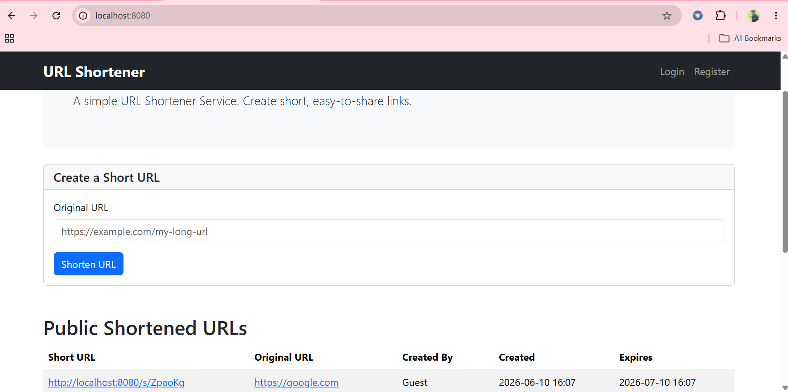

### Login Page

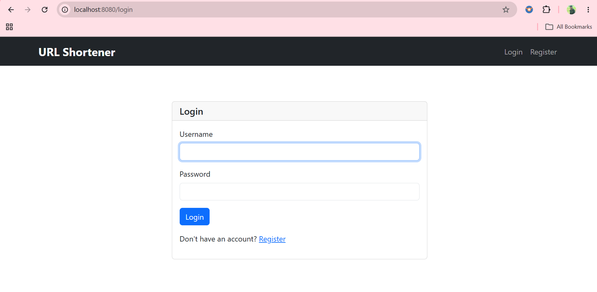

### Registration Page

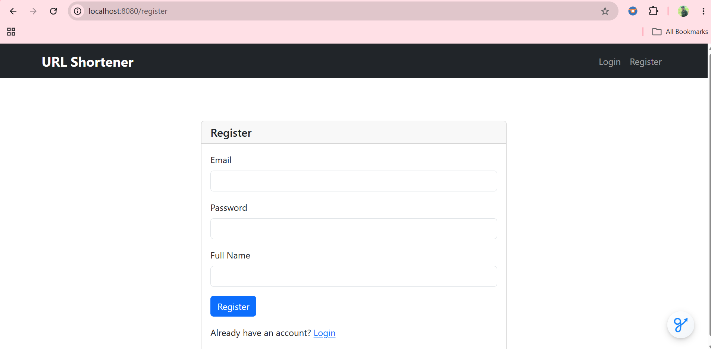

### Create Short 

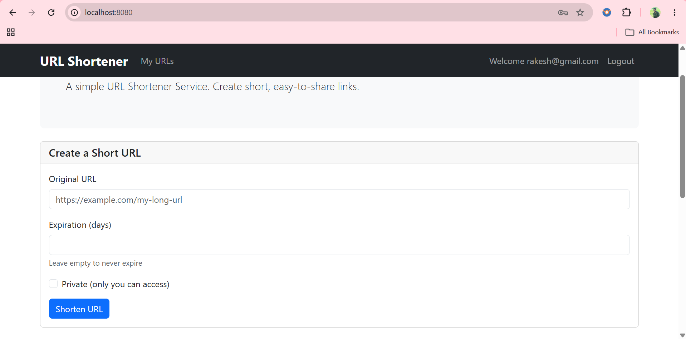

### My URLs Dashboard

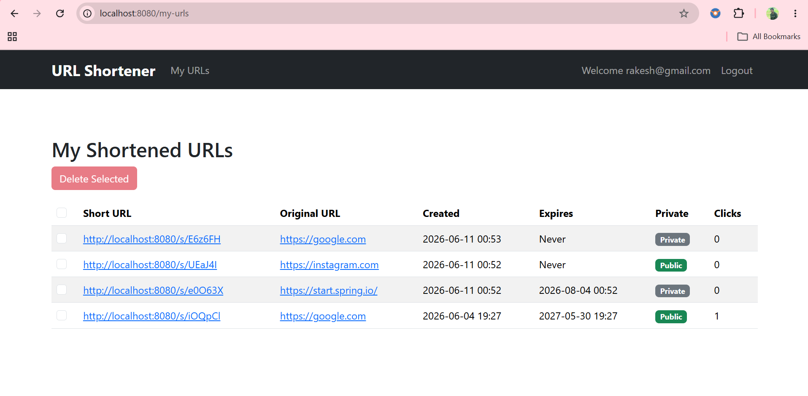

### Admin Dashboard

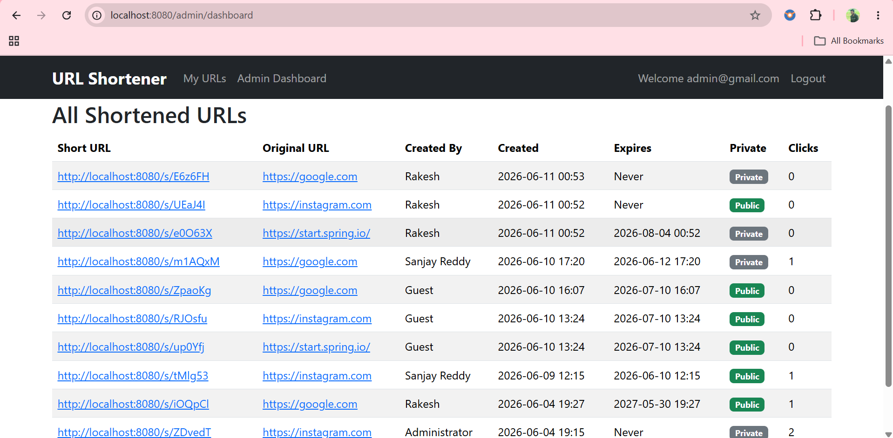

---

## Production Deployment

### Deployment Dashboard

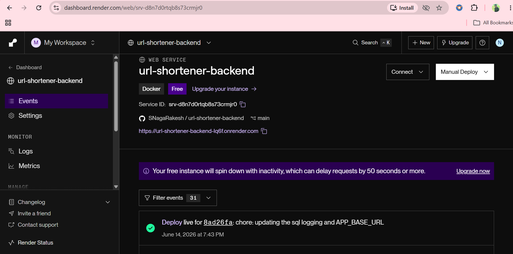

### MySQL Instance - Railway

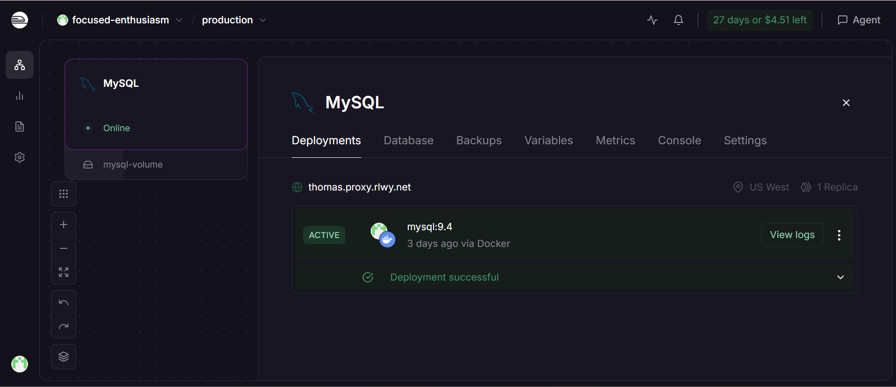

### Network Logs - Railway Instance

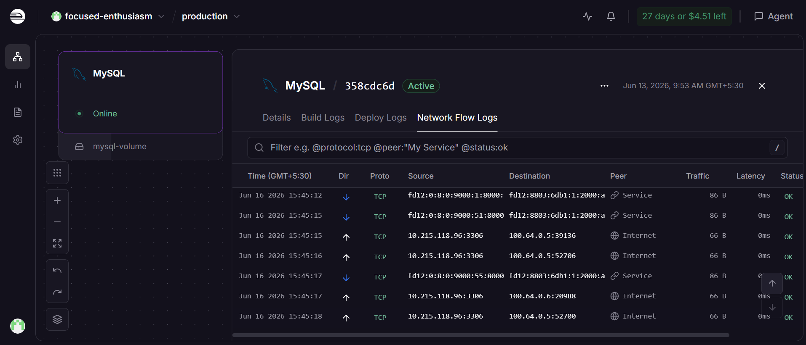

### Testing GET Request for Home Page - Postman API

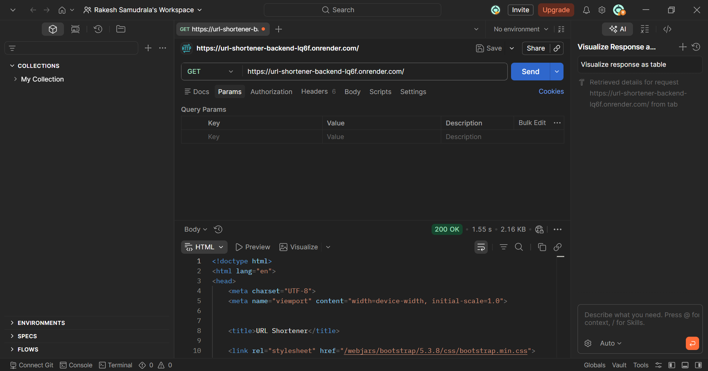

### Testing POST Request for Short URL Creation - Postman API

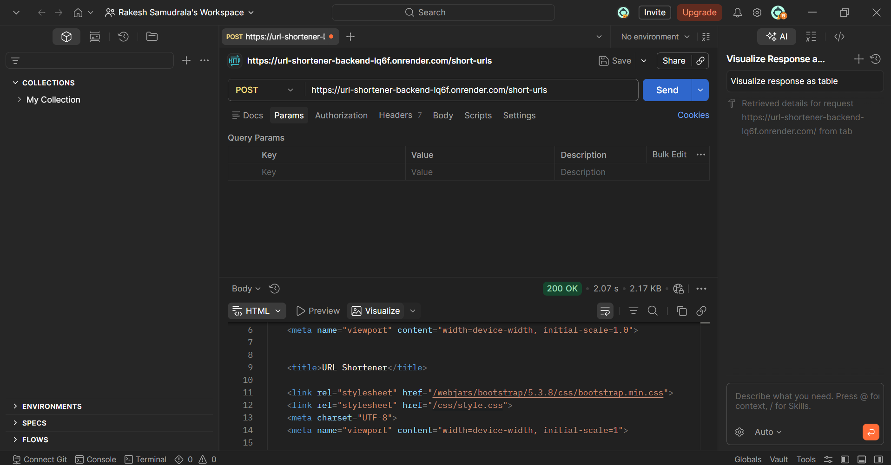

### Home Page After Deployment

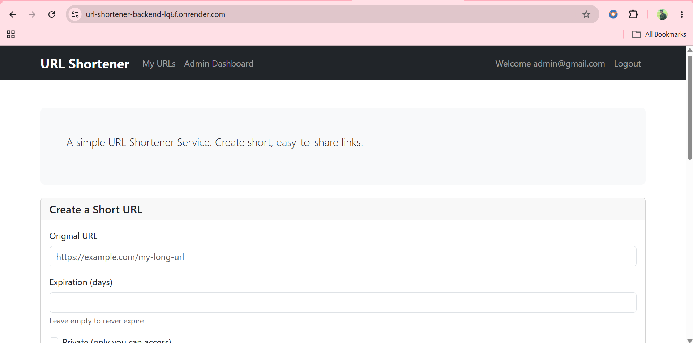

### Admin Dashboard After Deployment

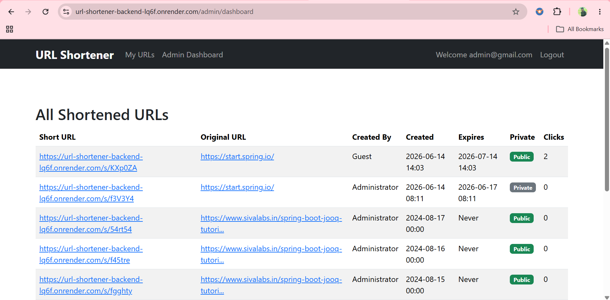

---

## Features

### Guest Users

* Create shortened URLs without registration.
* Access public shortened URLs.
* Redirect using generated short links.

### Registered Users

* User registration and login.
* Create shortened URLs.
* Configure URL expiration in days.
* Create private URLs.
* View all owned URLs.
* Delete individual URLs.
* Bulk delete multiple URLs.
* Track URL click counts.
* Access private URLs created by themselves.

### Admin Features

* Dedicated admin dashboard.
* View all non-private URLs in the system.
* Monitor URL activity across the application.
* Role hierarchy support.

### Security Features

* Spring Security integration.
* Password encryption.
* Role-based access control.
* Method-level security.
* Authentication and authorization support.

Role hierarchy:

```text
ADMIN > USER
```

---

## Tech Stack

| Category           | Technology        |
| ------------------ | ----------------- |
| Language           | Java 25           |
| Framework          | Spring Boot 4.0.6 |
| Build Tool         | Maven             |
| Security           | Spring Security   |
| ORM                | Spring Data JPA   |
| Template Engine    | Thymeleaf         |
| Database           | MySQL 8           |
| Database Migration | Flyway            |
| Containerization   | Docker            |
| Version Control    | Git & GitHub      |

---

## How It Works

1. A user submits an original URL.
2. The application generates a unique 6-character alphanumeric short key.
3. The URL mapping is stored in MySQL.
4. The generated short URL can be shared and accessed.
5. When a short URL is visited, the application validates access permissions and expiration status.
6. Valid requests are redirected to the original URL.
7. Successful redirects increment the click count.

### Short Key Generation

Short keys are generated using randomly selected alphanumeric characters.

The application:

* Generates a candidate key.
* Checks whether the key already exists.
* Regenerates when necessary.
* Stores only unique short keys.

---

## Privacy & Expiration

### Private URLs

Registered users can create private URLs.

Private URLs:

* Are visible only to their creator.
* Cannot be accessed by other users.
* Cannot be accessed by administrators.
* Remain visible within the creator's dashboard.

Administrators can view URL records but cannot access the private destination URL.

### URL Expiration

Users can configure an expiration period for their URLs.

After expiration:

* The URL record remains in the database.
* Redirection is blocked.
* Users are redirected to a dedicated expiration error page.

---

## Database Design

### Users

| Column   |
| -------- |
| email    |
| password |
| name     |
| role     |

### Short URLs

| Column      |
|-------------|
| shortKey    |
| originalUrl |
| createdBy   |
| createdAt   |
| expiresAt   |
| clickCount  |

### Relationship

```text
User (1) --------> (*) ShortUrl
```

One user can own multiple shortened URLs, while each shortened URL belongs to a single user.

---

## Major Endpoints

| Method | Endpoint      | Description              |
| ------ |---------------| ------------------------ |
| GET    | /             | Home Page                |
| GET    | /login        | Login Page               |
| GET    | /register     | Registration Page        |
| POST   | /register     | Register User            |
| POST   | /short-urls   | Create Short URL         |
| GET    | /s/{shortKey} | Redirect to Original URL |
| GET    | /my-urls      | User Dashboard           |
| POST   | /delete-urls  | Delete Selected URLs     |

---

## Running Locally

### Prerequisites

* Java 25
* Docker
* Git

### Clone Repository

```bash
git clone https://github.com/SNagaRakesh/url-shortener-backend.git
cd url-shortener-backend
```

### Start MySQL Container

```bash
docker compose up -d
```

### Run Application

Using Maven Wrapper:

```bash
./mvnw spring-boot:run
```

Or using Maven:

```bash
mvn spring-boot:run
```

### Access Application

```text
http://localhost:8080
```

---

## Production Deployment Experience

One of the goals of this project was to understand how a Spring Boot application behaves in a production environment compared to a local development environment.

To achieve this, the application was successfully deployed to a cloud platform and connected to a cloud-hosted MySQL database.

During deployment, I gained practical experience with:

* Environment-specific application configuration
* Externalizing sensitive values using environment variables
* Managing separate local and production configurations
* Cloud database connectivity
* Deployment troubleshooting and validation

The deployment was successfully tested and verified in a production environment.

Since this project was created primarily for learning purposes, the cloud database instance was later suspended to avoid recurring infrastructure costs after the deployment objectives were completed.

This deployment experience provided valuable exposure to real-world application hosting and configuration management practices.


---

## Flyway Migrations

Database schema creation and updates are managed using Flyway migrations.

Migrations are automatically applied during application startup.

---

## Future Enhancements

* Deploy application to a cloud platform.
* Dockerize the complete application stack.
* QR code generation for shortened URLs.
* Advanced analytics dashboard.
* URL usage statistics and reporting.
* REST API support.
* Performance and caching improvements.

---

## What I Learned

This project was built to strengthen my practical Spring Boot development skills and gain experience building a real-world application from scratch.

Key concepts explored during development:

* Spring Boot application architecture.
* MVC design pattern.
* Spring Security.
* Authentication and authorization.
* Role hierarchy implementation.
* Spring Data JPA.
* Flyway database migrations.
* Docker fundamentals.
* Database design and relationships.
* Applying Object-Oriented Programming principles in a production-style application.
* Production deployment and environment configuration management.

The biggest challenge throughout the project was maintaining consistency and showing up every day to continue learning, building, and improving the application.

---

## Author

**Samudrala Naga Rakesh**

GitHub:
https://github.com/SNagaRakesh

Repository:
https://github.com/SNagaRakesh/url-shortener-backend

---

## License

This project currently does not specify a license.
